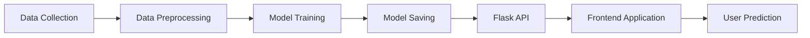
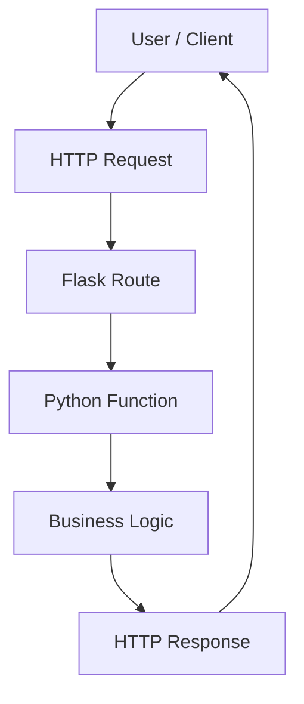
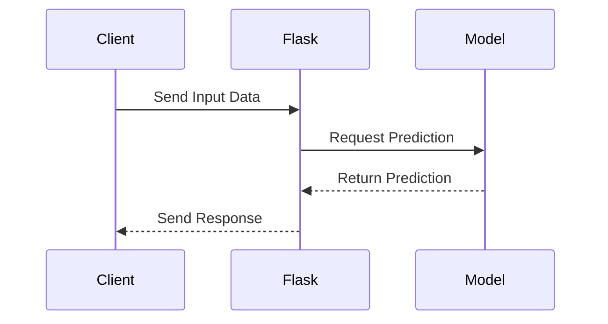
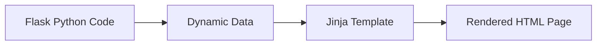
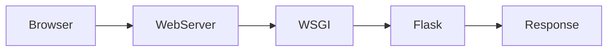
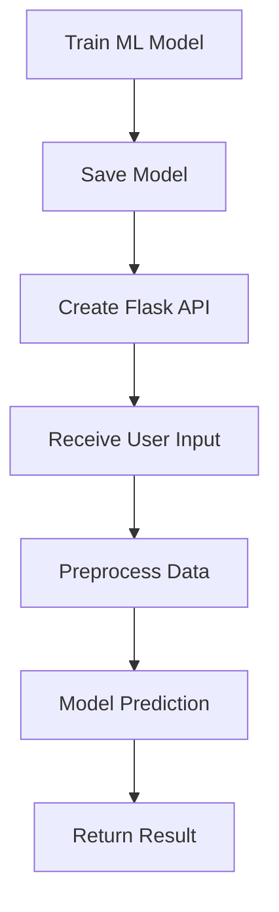

# 🚀 Flask API - MLOps Learning Journey

## 📌 Overview

This section covers **Flask API development** as part of the MLOps learning journey.

Flask is a lightweight Python web framework used to build web applications and REST APIs. In machine learning projects, Flask acts as a bridge between trained ML models and user applications.

It allows users to:

- Send input data
- Process requests
- Run ML model inference
- Return predictions/results


---

# 🎯 Role of Flask in MLOps

A typical ML deployment workflow:



Flask provides the API layer between the machine learning model and the application.

---

# 🏗️ Flask Application Architecture



### Flow:

1. User sends request
2. Flask receives request
3. Route handles the request
4. Python function executes logic
5. Response is returned

---

# 📂 Project Structure

```
03_flask_api
│
├── README.md
│
└── flask
    │
    ├── app.py
    ├── api.py
    ├── main.py
    ├── getpost.py
    ├── jinja.py
    ├── sample.json
    │
    ├── templates
    │   ├── index.html
    │   ├── about.html
    │   ├── form.html
    │   └── result.html
    │
    └── static
        └── css
            └── style.css
```

---

# ⚙️ Installation

Install Flask:

```bash
pip install Flask
```

Check Flask installation:

```bash
python -m flask --version
```

---

# ▶️ Running Flask Application

Navigate to Flask folder:

```bash
cd flask
```

Run the application:

```bash
python app.py
```

Application runs on:

```
http://127.0.0.1:5000/
```

---

# 🧩 Flask Basic Components

## 1. Flask Application

A Flask application starts by creating an instance of the Flask class.

```python
from flask import Flask

app = Flask(__name__)

@app.route("/")
def home():
    return "Hello Flask"

app.run()
```

---

## 2. Routes

Routes define URL endpoints that users can access.

Example:

```python
@app.route("/about")
def about():
    return "About Page"
```

---

## 3. HTTP Methods

| Method | Usage |
|--------|-------|
| GET | Fetch information |
| POST | Send data |
| PUT | Update data |
| DELETE | Delete data |

---

# 🔄 API Request Flow

The communication between client, Flask API, and ML model:



---

# 🌐 Jinja2 Template Engine

Flask uses **Jinja2** to create dynamic HTML pages.

Example:

```html
<h1>Hello {{name}}</h1>
```

### Jinja Template Flow



### Benefits:

- Dynamic pages
- Reusable templates
- Separation of frontend and backend

---

# 📡 WSGI Architecture

Flask communicates with web servers using **WSGI (Web Server Gateway Interface)**.



---

# 🤖 Flask for Machine Learning Deployment

Flask is commonly used for deploying machine learning models as APIs.



### ML Deployment Workflow:

1. Train machine learning model
2. Save trained model
3. Create Flask API endpoint
4. Accept user input
5. Preprocess input data
6. Generate prediction
7. Return prediction response

---

# 🧪 Example ML Prediction API

Example Flask API:

```python
from flask import Flask, request, jsonify
import pickle

app = Flask(__name__)

model = pickle.load(open("model.pkl", "rb"))

@app.route("/predict", methods=["POST"])
def predict():

    data = request.json

    prediction = model.predict([data["input"]])

    return jsonify({
        "prediction": prediction[0]
    })


if __name__ == "__main__":
    app.run(debug=True)
```

---

# 📚 Learning Outcomes

After completing this module:

✅ Understand Flask application structure  
✅ Create REST APIs  
✅ Handle GET and POST requests  
✅ Use Jinja2 templates  
✅ Understand WSGI architecture  
✅ Build ML deployment foundation  
✅ Understand API-based model serving  

---

# 🚀 Next Steps in MLOps

Upcoming topics:

- FastAPI
- Model Serialization
- Docker
- CI/CD Pipeline
- Cloud Deployment
- ML Monitoring
- Model Versioning

---

# 📖 Resources

- Flask Documentation  
- REST API Concepts  
- Python Web Development  
- Machine Learning Model Deployment Practices  

---

## 👩‍💻 Author

**Nidhi Dhameliya**

M.Tech Data Science & Machine Learning

Learning **MLOps, Machine Learning Deployment, and AI Engineering** 🚀
